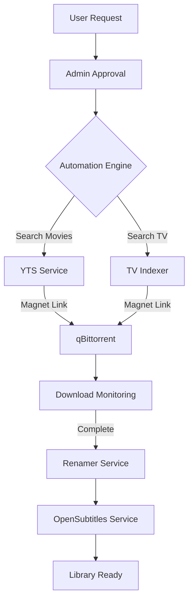

# Download Automation and Custom Indexers Plan

This plan focuses on building a custom automation engine within Arrgo that replaces external services like Prowlarr/Jackett, integrating directly with qBittorrent and OpenSubtitles.

## 1. Core Infrastructure Updates

- **Configuration**: Add `QBITTORRENT_URL`, `QBITTORRENT_USER`, and `QBITTORRENT_PASS` to `server/config/config.go`.
- **Database Schema**:
    - Update `server/database/migrations.go` to add `imdb_id` to `movies`, `shows`, and `requests` tables for precise searching.
    - Create a `downloads` table to track qBittorrent torrent hashes and map them to requests.
- **Models**: Update `server/models/request.go`, `server/models/movie.go`, and `server/models/show.go` to include `IMDBID`.

## 2. Custom Torrent Search Services

- **Movies (YTS)**: Implement `server/services/yts.go` to fetch high-quality movie torrents using the YTS API.
- **TV Shows**: Implement `server/services/tv_indexer.go` as a generic scraper/RSS reader (e.g., for 1337x or EZTV) to handle show episodes.
- **Indexer Framework**: Create an `Indexer` interface in `server/services/indexer.go` to allow easy addition of more providers.

## 3. qBittorrent Integration

- **Client Service**: Create `server/services/qbittorrent.go` to handle:
    - Login and session management.
    - Adding torrents by magnet link or info hash.
    - Monitoring active downloads (speed, progress, eta).
    - Categorizing downloads (e.g., `arrgo-movies`, `arrgo-tv`).

## 4. Automation & Orchestration

- **Workflow**: Create `server/services/automation.go` to:
    - Periodically check for approved requests.
    - Trigger searches across indexers.
    - Automatically add the best match to qBittorrent.
    - Coordinate with the existing `renamer.go` once downloads finish.
- **Approval Flow**: Update `server/handlers/requests.go` to support an admin "Approve" action that kicks off the automation.

## 5. Subtitles (OpenSubtitles)

- **Service**: Create `server/services/subtitles.go` to search OpenSubtitles by IMDB ID.
- **Naming**: Ensure Plex-friendly naming convention: `MovieTitle (Year) {tmdb-ID}.en.sdh.srt`.

## 6. Admin UI Enhancements

- **Download Monitor**: Create a new Admin page `server/templates/pages/admin/downloads.html` to view qBittorrent progress directly.
- **Requests Update**: Update `server/templates/pages/requests.html` to show download status (e.g., "Downloading 45%", "Finished").

